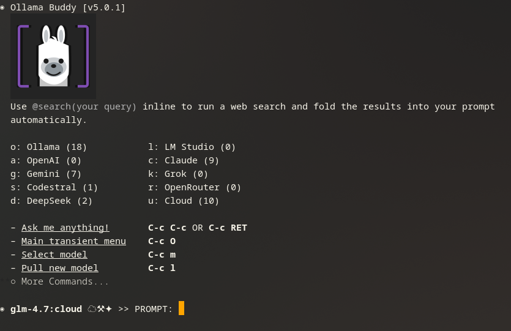
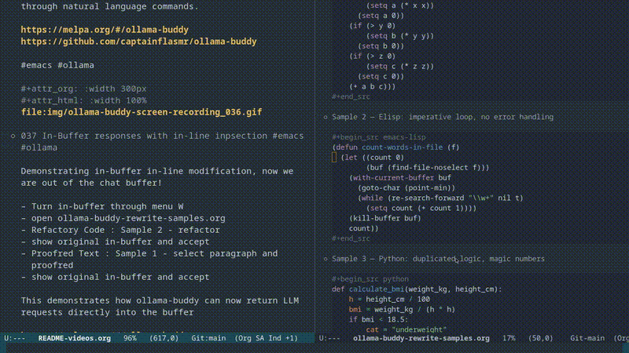
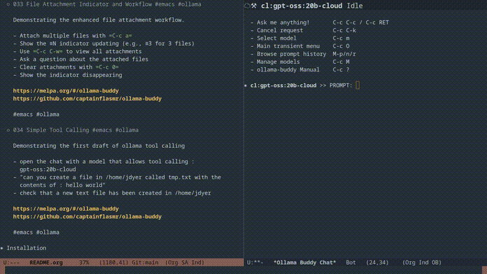
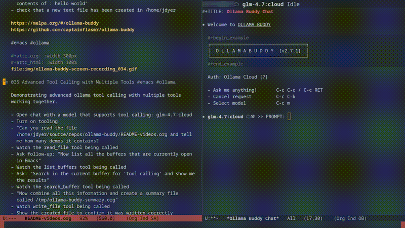
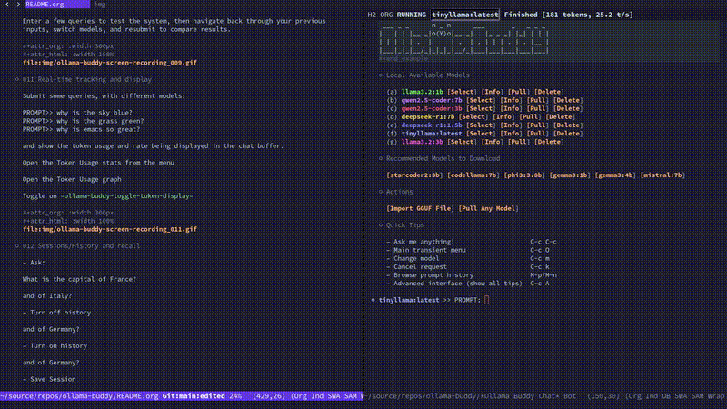

#+title: Ollama Buddy: Local LLM Integration for Emacs
#+author: James Dyer
#+email: captainflasmr@gmail.com
#+language: en
#+options: ':t toc:nil author:nil email:nil num:nil title:nil
#+startup: showall

#+attr_org: :width 300px
#+attr_html: :width 200px

* Ollama Buddy

An Emacs package for interacting with local LLMs via [[https://ollama.ai/][Ollama]], with support for remote providers (OpenAI, Claude, Gemini, Grok, Copilot, Codestral, DeepSeek, OpenRouter) and Ollama Cloud models. Requires Emacs 29.1+.

#+begin_src elisp
(use-package ollama-buddy
  :ensure t
  :bind
  ("C-c o" . ollama-buddy-role-transient-menu)
  ("C-c O" . ollama-buddy-transient-menu))
#+end_src

That's it!, start =ollama serve=, open Emacs, press =C-c o=, select =[o]= to open chat, and go, here is what will be presented:

#+attr_org: :width 300px
#+attr_html: :width 100%

There are videos demonstrating functionality:

https://www.youtube.com/@OllamaBuddyforEmacs

* Want More Details?

For a deeper dive have a ganders at:

- [[file:README-full.org][Full README]] -- Detailed README tutorials, transient menu guide, and role setup

* Demos

** In-buffer replacement demo

Demonstrating in-buffer in-line modification, now we are out of the chat buffer!

#+attr_org: :width 300px
#+attr_html: :width 100%

** Tool Calling Demo

LLMs can invoke Emacs functions: read/write files, execute shell commands, search buffers, and more.

#+attr_org: :width 300px
#+attr_html: :width 100%

** Advanced Tool Calling Demo

Demonstrating advanced ollama tool calling with multiple tools working together.

#+attr_org: :width 300px
#+attr_html: :width 100%

** Quick Demo

Submit queries, swap models, view token usage and statistics:

#+attr_org: :width 300px
#+attr_html: :width 100%

* Features

- *Tool Calling* -- LLMs can invoke registered Emacs functions (file ops, shell commands, buffer search, calculations). Safe mode restricts to read-only tools.
- *Multiple Providers* -- Local Ollama, Ollama Cloud, OpenAI, Claude, Gemini, Grok, GitHub Copilot, Codestral, DeepSeek, OpenRouter, and any generic OpenAI-compatible server (LM Studio, llama.cpp, vLLM, Jan…)
- *Web Search* -- Inline =@search(query)= syntax for real-time web search via Ollama's API
- *Interactive Menus* -- Transient popup menus with role-based command grouping
- *Roles & Presets* -- Switchable command configurations (developer, writer, tutor, documenter, custom); each command carries a =:destination= hint (=chat= or =in-buffer=) so rewrites go to the right place automatically
- *Sessions & History* -- Save/load conversations, prompt history navigation
- *Thinking Block Folding* -- Reasoning model output (=<think>= tags, DeepSeek API) rendered as collapsible org headings; =TAB= on the heading to peek mid-stream
- *File Attachments* -- Attach files and images (vision models) to conversations
- *Model Management* -- Pull, delete, copy models; categorized recommendations; cloud model support
- *Multishot & Benchmark* -- Send the same prompt to multiple models simultaneously; benchmark all models in one command with per-model timeout
- *Parameters* -- Full control over temperature, top_k, top_p, and all Ollama API options
- *Token Tracking* -- Real-time token usage statistics with graphs
- *Skills* -- Specialized AI personas and task-specific instructions integrated into the User Prompts library; use `/skill` slash command or `@skill(name)` for inline expansion
- *RAG* -- Index local documents and source code; retrieve relevant context via semantic search; inline =@rag(query)= syntax; configurable embedding backend (Ollama =/api/embed= or any OpenAI-compatible =/v1/embeddings= service, e.g. LM Studio)
- *In-Buffer Replace* -- Stream LLM output directly into the source buffer, replacing the selected region in-place; accept/reject confirmation; inline diff view (=C-c d=) with word-level smerge highlighting; automatic code-fence stripping

* What's New (v5.0.1)

Auto-scroll toggle for following streaming output.

- *Auto-Scroll Toggle* -- =C-c g= toggles =ollama-buddy-auto-scroll=, jumping to the end of the buffer when enabled.  Header line shows =↓= when active.  Works when toggled mid-stream.

* What's New (v5.0.0)

Tool calling for all providers — OpenAI, Claude, and Gemini API types all support function calling through =ollama-buddy-provider-create=.

- *Tool Calling for External Providers* -- All three API types (OpenAI-compatible, Claude, Gemini) now support tool calling.  Tools are automatically converted from the internal format to each provider's native schema at send time.  This covers OpenAI, DeepSeek, Grok, OpenRouter, Copilot, Codestral, LM Studio, Anthropic Claude, and Google Gemini.

* What's New (v4.2.0)

Tool-augmented search — LLMs can now autonomously search the web and query local documents during tool calling.

- *=web_search= Tool* -- Models can autonomously search the web for current information during tool calling conversations.  Uses the Ollama web search API; returns plain-text results (titles, URLs, snippets) directly as tool context.
- *=rag_search= Tool* -- Models can autonomously search local RAG indexes for relevant document chunks during tool calling.  Searches all indexes by default, or a specific one by name.
- *Emacs 29.1 Minimum* -- Org folding now uses the =org-fold= text-property API directly, fixing thinking block folding issues on modern Emacs.
- *Thinking Fold Robustness* -- =TAB= to peek at a thinking block mid-stream now stays open instead of being immediately re-folded.
- *Welcome Screen* -- Extra commands under a folded =** More Commands= heading; project path is a clickable dired link.
- *Model Management* -- Running models listed individually with per-model Unload buttons; =[x]/[ ]= checkbox removed.
- *=C-c E=* -- Toggle tool auto-execute from the chat buffer.

* What's New (v4.1.1)

Recommended Models browser and model letter ordering.

- *Recommended Models Buffer* -- =C-c L= opens a dedicated buffer showing categorised Ollama Hub models not yet installed, with pull buttons and capability indicators. Removed from the model management buffer.
- *Model Letter Ordering* -- Cloud models now get =a, b, c...= first, matching the top-to-bottom display order in model management.
- *Key Binding Change* -- Session Load moved from =C-c L= to =C-c f=.

* What's New (v4.1.0)

Response metadata and SVG context bar.

- *Org Property Drawers* -- Every response heading now carries a =:PROPERTIES:= drawer with =:TIMESTAMP:=, =:TOKENS:=, =:RATE:=, =:ELAPSED:=, and =:WAIT:=. Queryable with =org-columns=; survives session save/load. Folded by default.
- *Org File Links* -- Attached files shown as clickable =[[file:...][name]]= org links.
- *SVG Context Bar* -- In GUI Emacs, the header-line context bar now renders as a colour-coded SVG with segments for history, system prompt, attachments, web search, RAG, prompt, and free space. Terminal Emacs falls back to the existing text bar.
- *Removed: Token Stats Toggle* -- =C-c T= and =ollama-buddy-display-token-stats= defcustom removed; token data now lives in the property drawer. Global stats viewer (=C-c #=) unchanged.

* What's New (v4.0.0)

Generic provider system — register any OpenAI/Claude/Gemini-compatible API with a single function call.

- *Generic Provider Registration* -- =ollama-buddy-provider-create= is a single factory function for registering any external LLM provider. Supports three API types: =openai= (OpenAI-compatible), =claude= (Anthropic Messages API), and =gemini= (Google generateContent API). No separate elisp file needed per provider.
- *Backward Compatible* -- Existing =(require 'ollama-buddy-openai)= etc. still work. Each provider file is now a thin wrapper around =ollama-buddy-provider-create=, preserving all =defcustom= variables. These wrappers will be removed in a future release.
- *Migration Path* -- Replace per-provider =require= calls with =ollama-buddy-provider-create= in your config. See =CHANGELOG.org= for full migration examples.
- *Dynamic Model Discovery* -- Providers with a =:models-endpoint= automatically fetch available models on registration, with optional =:models-filter= predicates.
- *~550 lines saved* -- The eight provider files dropped from ~1,346 lines to ~615 lines total, with all shared logic consolidated in =ollama-buddy-provider.el= (~779 lines).

* Recent Changes

| Version | Summary                                                                                                                                                                                                                   |
|---------+---------------------------------------------------------------------------------------------------------------------------------------------------------------------------------------------------------------------------|
| *5.0.1* | Auto-scroll toggle (=C-c g=, =↓= indicator); works mid-stream. |
| *5.0.0* | Tool calling for all providers: OpenAI, Claude, and Gemini API types support function calling; HTTP error detection; Gemini native =systemInstruction=. |
| *4.2.0* | Tool-augmented search: =web_search= and =rag_search= built-in tools; Emacs 29.1 minimum; thinking fold robustness; welcome screen folded commands; model management running models section. |
| *4.1.1* | Recommended Models browser (=C-c L=), model letter ordering matches display, session load moved to =C-c f=.                                                                                                              |
| *4.1.0* | Response property drawers (=:TOKENS:=, =:RATE:=, etc.), org file links for attachments, SVG context bar, removed token stats toggle.                                                                                     |
| *4.0.0* | Generic provider system (=ollama-buddy-provider-create=) — register any OpenAI/Claude/Gemini-compatible API with one call. Existing =require= wrappers still work but are deprecated.                                     |
| *3.7.1* | Code quality, async model info, error cleanup, =/cd= directory switching, removed Fabric/Awesome.                                                                                                                         |
| *3.7.0* | RAG pause/resume with periodic checkpointing; new built-in tools (=search_files=, =get_region=, =get_buffer_info=, =describe_symbol=, =eval_elisp=).                                                                     |
| *3.6.0* | RAG incremental updates (re-index only changed files) and cancellation support.                                                                                                                                           |
| *3.5.1* | Curl backend refactor — unified request pipeline, shared stream processor, full feature parity with network-process backend (46% code reduction).                                                                         |
| *3.5.0* | Project Init (experimental) — =/init= generates a cached project summary that auto-loads in future sessions; a step towards code-oriented LLM workflows.                                                                 |
| *3.4.1* | Thinking Peek and Rewind — =TAB= peek at thinking mid-stream; =C-u C-u C-c C-c= to rewind conversation from any prompt heading.                                                                                          |
| *3.4.0* | Skills — Local Org-mode based AI personas and task-specific instructions; `/skill` slash command and `@skill(name)` inline syntax.                                                                                        |
| *3.3.0* | Smart Project Integration — `project.el` support for contextual file attachment and `/project` slash command.                                                                                                             |
| *3.2.2* | Main transient menu reorganization (=C-c O=) — 4x2 compact grid with streamlined sub-menus and top-level History/Sessions.                                                                                                |
| *3.2.1* | Benchmark all models (=C-c u=) — one-command multishot across all models with per-model timeout; builds persistent token stats.                                                                                           |
| *3.1.0* | Inline ghost-text code completions (=ollama-buddy-completion=) — simple, manual Copilot-style completions with FIM context, thinking model support, fence stripping.                                                      |
| *3.0.0* | Generic OpenAI-compatible chat provider (=ollama-buddy-openai-compat=) — connect to LM Studio, llama.cpp, vLLM, Jan, or any OpenAI-API server.                                                                            |
| *2.9.2* | =:destination= property for command definitions — per-command routing to =chat= or =in-buffer=, overriding the global toggle; all built-in commands and presets pre-annotated.                                            |
| *2.9.1* | Welcome screen tips — =ollama-buddy-tips.el= shows a random usage tip on every fresh chat buffer; disable with =(setq ollama-buddy-show-tips nil)=.                                                                       |
| *2.9*   | Configurable RAG embedding backend — =ollama-buddy-rag-embedding-base-url= and =ollama-buddy-rag-embedding-api-style= let you point RAG at any =/v1/embeddings= server (e.g. LM Studio) instead of Ollama's =/api/embed=. |
| *2.8.1* | In-buffer replace polish: inline diff view (=C-c d=, word-level smerge highlighting), automatic clean-output tone, code-fence stripping, =C-c W= toggle.                                                                  |
| *2.8.0* | Initial in-buffer replace mode — stream rewrites directly into the source buffer; =C-c C-c= accept / =C-c C-k= reject.                                                                                                    |

See [[file:CHANGELOG.org]] for full history.

* Installation

** MELPA Simple

#+begin_src elisp
(use-package ollama-buddy
  :ensure t
  :bind
  ("C-c o" . ollama-buddy-role-transient-menu)
  ("C-c O" . ollama-buddy-transient-menu))
#+end_src

On first launch, press =C-c O= → =I= to install the bundled presets and user prompts for the full experience (see [[*Installing Presets and User Prompts][Installing Presets and User Prompts]]).

** With Remote Providers (v4.0+ recommended)

#+begin_src elisp
(use-package ollama-buddy
  :ensure t
  :bind
  ("C-c o" . ollama-buddy-role-transient-menu)
  ("C-c O" . ollama-buddy-transient-menu)
  :config
  (require 'ollama-buddy-provider)
  (ollama-buddy-provider-create
   :name "OpenAI"
   :prefix "a:"
   :api-key (lambda () (auth-source-pick-first-password :host "ollama-buddy-openai" :user "apikey"))
   :endpoint "https://api.openai.com/v1/chat/completions"
   :default-model "gpt-4o"
   :models-endpoint "https://api.openai.com/v1/models"
   :models-filter (lambda (id) (string-match-p "gpt" id)))
  ;; add other providers similarly …
  )
#+end_src

** With Remote Providers (legacy, still works)

#+begin_src elisp
(use-package ollama-buddy
  :ensure t
  :bind
  ("C-c o" . ollama-buddy-role-transient-menu)
  ("C-c O" . ollama-buddy-transient-menu)
  :custom
  (ollama-buddy-openai-api-key
   (auth-source-pick-first-password :host "ollama-buddy-openai" :user "apikey"))
  ;; add other providers similarly …
  :config
  (require 'ollama-buddy-openai nil t)
  ;; other cloud providers …
  )
#+end_src

** With a Local OpenAI-Compatible Server (LM Studio, llama.cpp, vLLM…)

No API key needed for local servers.  Use =ollama-buddy-provider-create= with =:models-endpoint= to auto-discover models:

#+begin_src elisp
(use-package ollama-buddy
  :ensure t
  :bind
  ("C-c o" . ollama-buddy-role-transient-menu)
  ("C-c O" . ollama-buddy-transient-menu)
  :config
  (require 'ollama-buddy-provider)
  (ollama-buddy-provider-create
   :name "LM Studio"
   :prefix "l:"
   :endpoint "http://localhost:1234/v1/chat/completions"
   :models-endpoint "http://localhost:1234/v1/models"))
#+end_src

Optionally also route RAG embeddings through the same server:

#+begin_src elisp
(setq ollama-buddy-rag-embedding-base-url "http://localhost:1234")
(setq ollama-buddy-rag-embedding-api-style 'openai)
(setq ollama-buddy-rag-embedding-model "nomic-embed-text")
#+end_src

** Manual

#+begin_src shell
git clone https://github.com/captainflasmr/ollama-buddy.git
#+end_src

#+begin_src elisp
(add-to-list 'load-path "path/to/ollama-buddy")
(require 'ollama-buddy)
(global-set-key (kbd "C-c o") #'ollama-buddy-role-transient-menu)
(global-set-key (kbd "C-c O") #'ollama-buddy-transient-menu)
#+end_src

** Installing Presets and User Prompts

Role presets and user prompts ship with the package but need to be copied into your Emacs configuration directory to be editable.  If they are missing, the chat welcome screen will show a reminder and the transient menu will offer an *Install Extras* entry.

*** From Emacs (recommended)

Press =C-c O= → =I= (or =M-x ollama-buddy-install-extras=).  This copies the bundled directories from the installed package, or downloads them from GitHub if the package was installed without them.

*** Manual (shell)

#+begin_src bash
cd ~/.emacs.d

# extract out the ollama-buddy-presets and ollama-buddy-user-prompts
curl -sL https://api.github.com/repos/captainflasmr/ollama-buddy/tarball/main | \
    tar -xzf - --transform=’s|[^/]*/||’ \
        --wildcards \
        ‘*/ollama-buddy-presets/*’ \
        ‘*/ollama-buddy-user-prompts/*’
#+end_src

The two directories installed are:

1. *=ollama-buddy-presets=* – Pre-defined role presets (developer, writer, tutor, etc.) as =.el= files.
2. *=ollama-buddy-user-prompts=* – Bundled system prompts organized by category (coding, writing, emacs, skills, etc.).

* My current configuration

#+begin_src elisp
(use-package ollama-buddy
  :demand t
  :bind
  ("C-c o" . ollama-buddy-role-transient-menu)
  ("C-c O" . ollama-buddy-transient-menu)
  :config
  ;; overall default model
  (setq ollama-buddy-default-model "glm-4.7:cloud")

  ;; ;; deprecated external LLM
  ;; (setq ollama-buddy-openai-api-key
  ;;       (auth-source-pick-first-password :host "ollama-buddy-openai" :user "apikey"))
  ;; (setq ollama-buddy-claude-api-key
  ;;       (auth-source-pick-first-password :host "ollama-buddy-claude" :user "apikey"))
  ;; (setq ollama-buddy-gemini-api-key
  ;;       (auth-source-pick-first-password :host "ollama-buddy-gemini" :user "apikey"))
  ;; (setq ollama-buddy-grok-api-key
  ;;       (auth-source-pick-first-password :host "ollama-buddy-grok" :user "apikey"))
  ;; (setq ollama-buddy-codestral-api-key
  ;;       (auth-source-pick-first-password :host "ollama-buddy-codestral" :user "apikey"))
  ;; (setq ollama-buddy-openrouter-api-key
  ;;       (auth-source-pick-first-password :host "ollama-buddy-openrouter" :user "apikey"))
  ;; (setq ollama-buddy-deepseek-api-key
  ;;       (auth-source-pick-first-password :host "ollama-buddy-deepseek" :user "apikey"))
  ;; (require 'ollama-buddy-openai nil t)
  ;; (require 'ollama-buddy-claude nil t)
  ;; (require 'ollama-buddy-gemini nil t)
  ;; (require 'ollama-buddy-grok nil t)
  ;; (require 'ollama-buddy-codestral nil t)
  ;; (require 'ollama-buddy-copilot nil t)
  ;; (require 'ollama-buddy-openrouter nil t)
  ;; (require 'ollama-buddy-deepseek nil t)
  
  ;; cloud / web-search keys (not provider-managed)
  (setq ollama-buddy-cloud-api-key
        (auth-source-pick-first-password :host "ollama-buddy-cloud" :user "apikey"))
  (setq ollama-buddy-web-search-api-key
        (auth-source-pick-first-password :host "ollama-buddy-web-search" :user "apikey"))
  (setq ollama-buddy-cloud-session-token "<session-token>"

  ;; Generic provider registration (replaces individual require files)
  (require 'ollama-buddy-provider)

  (ollama-buddy-provider-create
   :name "OpenAI" :prefix "a:"
   :api-key (lambda () (auth-source-pick-first-password
                        :host "ollama-buddy-openai" :user "apikey"))
   :endpoint "https://api.openai.com/v1/chat/completions"
   :models-endpoint "https://api.openai.com/v1/models"
   :models-filter (lambda (id) (string-match-p "\\(gpt\\|o[0-9]\\)" id)))

  (ollama-buddy-provider-create
   :name "Claude" :prefix "c:" :api-type 'claude
   :api-key (lambda () (auth-source-pick-first-password
                        :host "ollama-buddy-claude" :user "apikey"))
   :endpoint "https://api.anthropic.com/v1/messages"
   :models-endpoint "https://api.anthropic.com/v1/models")

  (ollama-buddy-provider-create
   :name "Gemini" :prefix "g:" :api-type 'gemini
   :api-key (lambda () (auth-source-pick-first-password
                        :host "ollama-buddy-gemini" :user "apikey"))
   :endpoint "https://generativelanguage.googleapis.com/v1beta/models/%s:generateContent"
   :models-endpoint "https://generativelanguage.googleapis.com/v1/models"
   :models-filter (lambda (id) (string-match-p "gemini" id)))

  (ollama-buddy-provider-create
   :name "Grok" :prefix "k:"
   :api-key (lambda () (auth-source-pick-first-password
                        :host "ollama-buddy-grok" :user "apikey"))
   :endpoint "https://api.x.ai/v1/chat/completions"
   :models-endpoint "https://api.x.ai/v1/models")

  (ollama-buddy-provider-create
   :name "Codestral" :prefix "s:"
   :api-key (lambda () (auth-source-pick-first-password
                        :host "ollama-buddy-codestral" :user "apikey"))
   :endpoint "https://api.mistral.ai/v1/chat/completions"
   :models '("codestral-latest"))

  (ollama-buddy-provider-create
   :name "OpenRouter" :prefix "r:"
   :api-key (lambda () (auth-source-pick-first-password
                        :host "ollama-buddy-openrouter" :user "apikey"))
   :endpoint "https://openrouter.ai/api/v1/chat/completions"
   :models-endpoint "https://openrouter.ai/api/v1/models"
   :extra-headers '(("HTTP-Referer" . "https://github.com/captainflasmr/ollama-buddy")
                    ("X-Title" . "ollama-buddy")))

  (ollama-buddy-provider-create
   :name "DeepSeek" :prefix "d:"
   :api-key (lambda () (auth-source-pick-first-password
                        :host "ollama-buddy-deepseek" :user "apikey"))
   :endpoint "https://api.deepseek.com/chat/completions"
   :models '("deepseek-chat" "deepseek-reasoner"))

  (require 'ollama-buddy-completion)

  (setq ollama-buddy-completion-model "qwen3-coder-next:cloud")

  ;; setup default custom menu for preferred models
  (ollama-buddy-update-menu-entry 'refactor-code     :model "minimax-m2.1:cloud")
  (ollama-buddy-update-menu-entry 'git-commit        :model "glm-4.7:cloud")
  (ollama-buddy-update-menu-entry 'describe-code     :model "minimax-m2.1:cloud")
  (ollama-buddy-update-menu-entry 'dictionary-lookup :model "minimax-m2.1:cloud")
  (ollama-buddy-update-menu-entry 'synonym           :model "minimax-m2.1:cloud")
  (ollama-buddy-update-menu-entry 'proofread         :model "minimax-m2.1:cloud")

  ;; dired integration
  (with-eval-after-load 'dired
    (define-key dired-mode-map (kbd "C-c C-a") #'ollama-buddy-dired-attach-marked-files)))
#+end_src

* Key Bindings (Chat Buffer)

| Key       | Action                        |
|-----------+-------------------------------|
| C-c C-c   | Send prompt                   |
| C-c RET   | Send prompt (alt)             |
| C-c C-k   | Cancel request                |
| C-c m     | Change model                  |
| C-c l     | Pull new model                |
| C-c M     | Manage models                 |
| C-c P     | Project sub-menu              |
| C-c p     | Parameter sub-menu            |
| C-c y     | System prompts sub-menu       |
| C-c +     | Settings menu                 |
| C-c S     | Save session                  |
| C-c O     | Main transient menu           |
| M-p / M-n | Browse prompt history         |
| C-c a     | Attach file                   |
| C-c 0     | Clear attachments             |
| C-c r     | RAG transient menu            |
| C-c C-s   | Show system prompt            |
| C-c C-r   | Reset system prompt           |
| C-c ~     | Select response tone          |
| C-c v     | Set keep-alive duration       |
| C-c !     | Toggle airplane mode          |
| C-c e     | Switch backend (network/curl) |
| C-c W     | Toggle in-buffer replace mode |
| C-c SPC   | Toggle tool calling           |
| C-c / s   | Web search and display        |
| C-c / a   | Web search and attach         |
| C-c d     | Inline diff view              |

* ollama API Support Tables

** Core API Endpoints

| API Endpoint              | Method | Purpose                            | Supported | Notes                                          |
|---------------------------+--------+------------------------------------+-----------+------------------------------------------------|
| =/api/chat=               | POST   | Send chat messages to a model      | Yes       | Core feature with streaming, tools, vision     |
| =/api/generate=           | POST   | Generate text without chat context | Partial   | Used for inline completions and model unloading |
| =/api/tags=               | GET    | List available local models        | Yes       | Used for model management                      |
| =/api/show=               | POST   | Show model information             | Yes       | Model info display                             |
| =/api/pull=               | POST   | Pull a model from Ollama library   | Yes       | Async pull with progress                       |
| =/api/push=               | POST   | Push a model to the Ollama library | No        | Not planned                                    |
| =/api/delete=             | DELETE | Delete a model                     | Yes       | Model management                               |
| =/api/copy=               | POST   | Copy a model                       | Yes       | Model management                               |
| =/api/create=             | POST   | Create a model from Modelfile/GGUF | Yes       | GGUF import supported                          |
| =/api/ps=                 | GET    | List running models                | Yes       | Shows loaded models in management buffer       |
| =/api/embed=              | POST   | Generate embeddings from text      | Yes       | RAG module via =ollama-buddy-rag.el= (v2.5.0+) |
| =/api/version=            | GET    | Get Ollama version                 | Yes       | Displayed on Model Management page             |
| =HEAD /api/blobs/:digest= | HEAD   | Check if blob exists               | No        | Not needed for current functionality           |
| =POST /api/blobs/:digest= | POST   | Push a blob                        | No        | Not needed for current functionality           |
| Cancel requests           | Custom | Terminate ongoing request          | Yes       | =C-c C-k= in chat buffer                       |

** Chat API Parameters (=/api/chat=)

| Parameter    | Supported | Notes                                                            |
|--------------+-----------+------------------------------------------------------------------|
| =model=      | Yes       | Per-command or global via =ollama-buddy-default-model=           |
| =messages=   | Yes       | Full conversation history support                                |
| =tools=      | Yes       | Tool calling via =ollama-buddy-tools.el= (v2.0.0+)               |
| =think=      | Yes       | Reasoning model support with visibility toggle                   |
| =format=     | Partial   | JSON mode not yet exposed                                        |
| =options=    | Yes       | Full implementation of all model parameters                      |
| =stream=     | Yes       | Toggleable with =ollama-buddy-toggle-streaming=                  |
| =keep_alive= | Yes       | Set via =ollama-buddy-set-keepalive= or =ollama-buddy-keepalive= |

** Generate API Parameters (=/api/generate=)

Used by =ollama-buddy-completion.el= for inline ghost-text completions and for model unloading.

| Parameter    | Supported | Notes                                                       |
|--------------+-----------+-------------------------------------------------------------|
| =model=      | Yes       | Set via =ollama-buddy-completion-model= or current model    |
| =prompt=     | Yes       | Buffer content before point (FIM prefix)                    |
| =suffix=     | Yes       | Buffer content after point (FIM suffix)                     |
| =images=     | No        | Vision uses chat endpoint instead                           |
| =format=     | No        | Not currently exposed                                       |
| =options=    | Yes       | =num_predict= and =temperature= for completions            |
| =system=     | Yes       | Completion system prompt (code-only output)                 |
| =template=   | No        | Uses model defaults                                         |
| =stream=     | Yes       | Streaming enabled by default                                |
| =raw=        | No        | Not currently needed                                        |
| =keep_alive= | Yes       | Used for model unloading (=keep_alive: 0=)                  |
| =context=    | N/A       | Deprecated - using messages array instead                   |

** Model Options Parameters

| Parameter Group         | Parameters                                                                                     | Supported |
|-------------------------+------------------------------------------------------------------------------------------------+-----------|
| *Temperature Controls*  | =temperature=, =top_k=, =top_p=, =min_p=, =typical_p=                                          | Yes       |
| *Repetition Controls*   | =repeat_last_n=, =repeat_penalty=, =presence_penalty=, =frequency_penalty=                     | Yes       |
| *Advanced Sampling*     | =mirostat=, =mirostat_tau=, =mirostat_eta=, =penalize_newline=, =stop=                         | Yes       |
| *Resource Management*   | =num_keep=, =seed=, =num_predict=, =num_ctx=, =num_batch=                                      | Yes       |
| *Hardware Optimization* | =numa=, =num_gpu=, =main_gpu=, =low_vram=, =vocab_only=, =use_mmap=, =use_mlock=, =num_thread= | Yes       |

** Additional API Features

| Feature                     | Supported | Notes                                               |
|-----------------------------+-----------+-----------------------------------------------------|
| Streaming responses         | Yes       | Default mode, toggleable                            |
| Tool calling                | Yes       | Built-in tools + custom tool registration (v2.0.0+) |
| Vision/Images               | Yes       | Base64 image encoding for multimodal models         |
| Structured outputs (JSON)   | No        | Not yet exposed                                     |
| Reproducible outputs (seed) | Yes       | Via parameters                                      |
| Load/Unload models          | Yes       | Via model management buffer                         |
| Cloud models                | Yes       | Via =ollama-buddy-cloud-models= (v1.1+)             |
| Thinking/Reasoning models   | Yes       | =think= parameter with visibility toggle            |

* Roadmap

** Future Considerations

*** Structured Outputs (JSON Schema)

The =format= parameter supports JSON schema for structured responses.

*Implementation considerations:*
- Define output schemas per command
- Integration with org-mode tables
- Structured data extraction workflows

*** Anthropic Messages API Compatibility

Ollama v0.14+ implements =/v1/messages= endpoint compatible with Anthropic's API format.

*Implementation considerations:*
- Option to route Claude-format requests through local Ollama
- Could simplify =ollama-buddy-claude.el= or provide fallback
- Support for tool_use and tool_result content blocks

*** Image Generation Support

Ollama v0.14+ supports local image generation with models like Z-Image Turbo (6B) and FLUX.2 Klein.

*Implementation considerations:*
- Detect image generation models
- Handle image output (save to file, display in buffer)
- Support generation parameters (width, height, steps, seed)
- Integration with org-mode inline images

* Documentation

- [[file:docs/ollama-buddy.org][Manual]] -- Full reference manual
- [[file:README-full.org][Full README]] -- Detailed README, tutorials, transient menu guide, and role setup
- [[file:CHANGELOG.org][Changelog]] -- Version-by-version changes
- [[https://www.emacs.dyerdwelling.family/tags/ollama-buddy/][Ollama Buddy Blog]] -- Blog articles for Ollama Buddy
